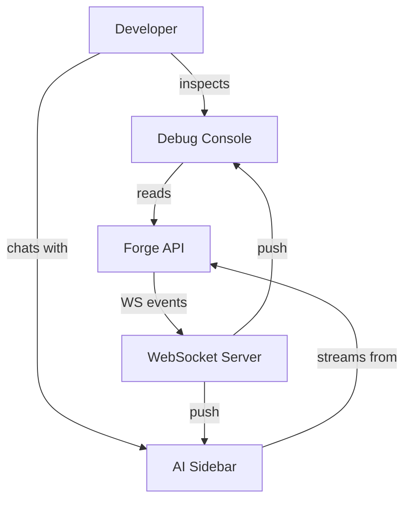
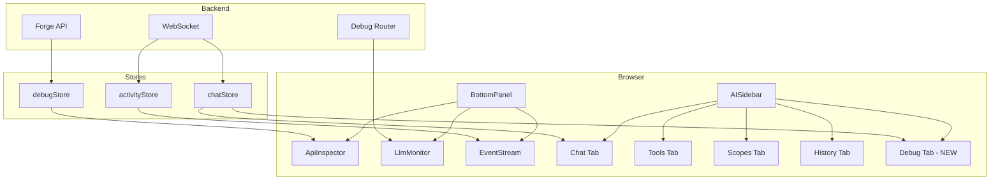
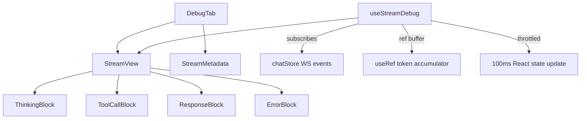

# Deep-Architect: Debug Console v2 Architecture
Date: 2026-03-13
Skill: deep-architect v1.0.0

---

## Overview
Refactored debug console architecture for Forge Web. Fixes broken LLM Monitor/Event Stream, improves API Inspector UX, adds structured stream view in AI Sidebar, and establishes consistent visual design. Key quality attributes: reliability (components work on all pages), usability (readable errors, selectable text, newest-first), and performance (no re-render cascades from WS events).

## C4 Diagrams

### Context

### Container

### Component: Debug Tab (NEW)

## Components

| Component | Responsibility | Technology | Interfaces |
|-----------|---------------|------------|------------|
| BottomPanel | Shell: tabs, resize, slug extraction | React + Zustand (debugPanelStore) | Props: none. Extracts slug from URL pathname. Passes slug to children. |
| ApiInspector | HTTP request/response log | React + debugStore | Props: slug (unused, for consistency). Reads debugStore.entries.toReversed(). |
| LlmMonitor | Backend LLM debug sessions | React + SWR | Props: slug. SWR key guarded: slug ? key : null. |
| EventStream | Real-time WS entity events | React + activityStore | Props: slug. Filters events by project === slug. |
| AISidebar | 5-tab panel (Chat, Tools, Scopes, History, Debug) | React + chatStore | Props: existing. New Debug tab added to tab list. |
| DebugTab (NEW) | Structured stream view | React + useStreamDebug hook | Props: slug. Subscribes to chatStore streaming. |
| StreamView (NEW) | Renders structured content blocks | React | Props: blocks[], streaming, metadata |
| ThinkingBlock (NEW) | Renders thinking/reasoning content | React | Props: content, collapsed |
| ToolCallBlock (NEW) | Renders tool call + result | React | Props: toolName, params, result, status |
| ResponseBlock (NEW) | Renders final response text | React | Props: content, streaming |
| ErrorDetail (NEW) | Rich error display | React | Props: error (ApiError with status, url, method, excerpt) |
| RequestDetailPanel (NEW) | Collapsible request/response inspector | React | Props: entry (ApiEntry with headers, params, bodies) |
| JsonView (NEW) | JSON syntax highlighting | React (custom or library) | Props: data, collapsed, copyable |
| useStreamDebug (NEW) | Hook: WS event -> structured blocks | React hook | Returns: { blocks, metadata, streaming, clear() } |

## Architecture Decision Records

| ADR | Decision | Rationale | Tradeoff |
|-----|----------|-----------|----------|
| ADR-1 | URL pathname extraction over useParams for slug | useParams only works inside matching route segment. BottomPanel is in root layout. | Lost: automatic Next.js router integration. Gained: works on every page. |
| ADR-2 | ref+subscription pattern for stream data | Per-token React state updates cause re-render cascades (L-018). | Lost: simple useState pattern. Gained: O(1) renders per 100ms interval regardless of token rate. |
| ADR-3 | CSS custom properties for debug theme | Shared design tokens enable incremental visual migration without global CSS changes. | Lost: CSS-in-JS type safety. Gained: runtime theming, easy to override, zero JS bundle cost. |
| ADR-4 | Custom JSON highlighter over react-json-view | react-json-view is 150KB+ gzipped, unmaintained. | Lost: rich interactive features (collapse/expand per node). Gained: <5KB bundle, tailored UX. |
| ADR-5 | Separate Debug tab over inline chat toggle | Debug info is fundamentally different from chat conversation - mixing them clutters both views. | Lost: single-view simplicity. Gained: dedicated space for structured data, no chat UX compromise. |

### ADR-1: URL Pathname Extraction for Slug
- Status: Proposed
- Context: BottomPanel lives in root layout (app/layout.tsx), outside the [slug] route segment. useParams() returns {} on non-project pages, causing LlmMonitor to fetch /projects/undefined/... and EventStream to filter for project===undefined.
- Decision: Extract slug from window.location.pathname using regex /\/projects\/([^\/]+)/. Pass as prop to all BottomPanel children.
- Alternatives: (a) Move BottomPanel inside ProjectLayout - breaks non-project page access. (b) Global Zustand store tracking current project - adds indirection. (c) usePathname() from next/navigation - works but is a string, still needs parsing.
- Consequences: Components become route-independent. Slug is undefined on non-project pages (graceful degradation). Slight coupling to URL structure.

### ADR-2: ref+subscription for Stream Data
- Status: Proposed
- Context: Debug tab needs to display streaming tokens grouped by content block type. Tokens arrive at 20-50/second via WS. Per-token setState would cause 20-50 re-renders/second.
- Decision: Accumulate tokens in useRef. Parse content_block boundaries. Throttle React state updates to every 100ms. Use requestAnimationFrame for smooth rendering.
- Alternatives: (a) useState per token - known to cause infinite loops (L-018). (b) Web Worker for parsing - over-engineering for text concatenation. (c) Virtual list - unnecessary, blocks are few (3-10 per response).
- Consequences: Smooth 10fps rendering regardless of token rate. More complex code than simple useState. Proven pattern from L-018 fix.

### ADR-3: CSS Custom Properties for Debug Theme
- Status: Proposed
- Context: Debug components have ad-hoc styling (bg-gray-900, text-green-400, border-gray-700 etc.) with no consistency.
- Decision: Define CSS custom properties on [data-debug-panel] selector. All debug components use these variables.
- Alternatives: (a) Tailwind plugin - couples to build config. (b) Styled-components - adds runtime JS. (c) CSS modules - no runtime theming.
- Consequences: Consistent look with zero JS cost. Easy to add dark/light themes later. Requires discipline to use variables instead of raw Tailwind classes.

### ADR-4: Custom JSON Highlighter
- Status: Proposed
- Context: Response bodies in API Inspector need syntax highlighting. react-json-view (most popular) is 150KB+ and unmaintained since 2023.
- Decision: Build a lightweight (<5KB) JSON syntax highlighter using regex-based tokenization and CSS classes.
- Alternatives: (a) react-json-view - large, unmaintained. (b) prism.js JSON grammar - 30KB but well-maintained. (c) No highlighting, just monospace - poor readability.
- Consequences: Minimal bundle impact. Full control over styling. No collapse/expand per node (acceptable for debug context where full visibility is preferred).

### ADR-5: Separate Debug Tab in AI Sidebar
- Status: Proposed
- Context: User wants to see what AI is doing in real-time (thinking, tool calls, response). Currently only final results visible in Chat tab.
- Decision: Add 5th tab (Debug) to AI Sidebar with structured stream view showing content blocks in real-time.
- Alternatives: (a) Inline toggle in Chat - mixes debug data with conversation flow. (b) Floating modal - discoverability issues. (c) Route to /debug page - loses sidebar convenience.
- Consequences: Clean separation of chat and debug views. Extra tab may feel crowded on small screens. Foundation for future observability (token budgets, cost tracking).

## Adversarial Findings

| # | Challenge | Finding | Severity | Mitigation |
|---|-----------|---------|----------|------------|
| 1 | FMEA | URL pathname regex fails on non-standard project slugs (e.g., slugs with special chars) | Low | Validate slug against known project list from projectStore |
| 2 | Anti-pattern | BottomPanel extracting slug from URL is a form of implicit coupling | Medium | Document the URL contract. Consider moving to Next.js usePathname() + parsing instead of raw window.location |
| 3 | Pre-mortem | 6 months later: Debug tab is stale because WS event format changed and nobody updated the parser | Medium | Type-safe WS event types shared between backend and frontend. Version the event schema. |
| 4 | Dependency | chatStore is single point of failure for Debug tab - if streaming changes, both Chat and Debug break | Medium | useStreamDebug hook isolates Debug tab from chatStore internals - only subscribes to WS events directly |
| 5 | Scale stress | 100 concurrent tool calls in a single LLM response flood Debug tab with blocks | Low | Virtual scrolling for block list if >50 blocks. In practice, responses have 3-10 blocks. |
| 6 | STRIDE | Debug panel may expose sensitive data (API keys in headers, auth tokens in request bodies) | High | Redact Authorization headers and any key/token/secret patterns in displayed data |
| 7 | Ops complexity | Custom JSON highlighter needs maintenance as JSON edge cases emerge | Low | Comprehensive test suite with edge cases (unicode, nested, large arrays, null values) |
| 8 | Cost projection | Bundle size delta from new components | Low | All new components are small (<5KB each). Total delta <20KB gzipped. |

## Tradeoffs

| Chose | Over | Because | Lost | Gained |
|-------|------|---------|------|--------|
| URL pathname extraction | useParams() | Works outside route segments | Router integration | Universal slug access |
| ref+subscription | useState per token | Prevents re-render cascades | Simplicity | Performance (10fps vs 50fps renders) |
| CSS custom properties | Tailwind classes | Runtime theming, consistency | Tailwind utility classes | Design system foundation |
| Custom JSON highlighter | react-json-view | Bundle size, maintainability | Interactive collapse/expand | <5KB vs 150KB+ |
| Separate Debug tab | Inline chat toggle | Clean separation of concerns | Single-view simplicity | Dedicated debug space |