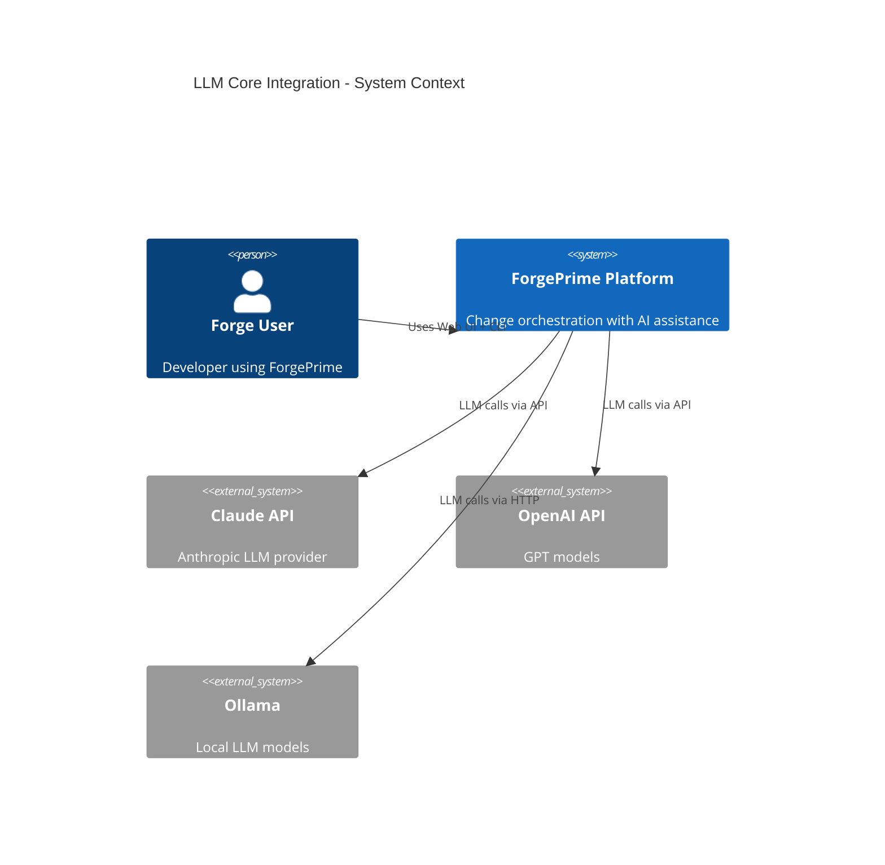
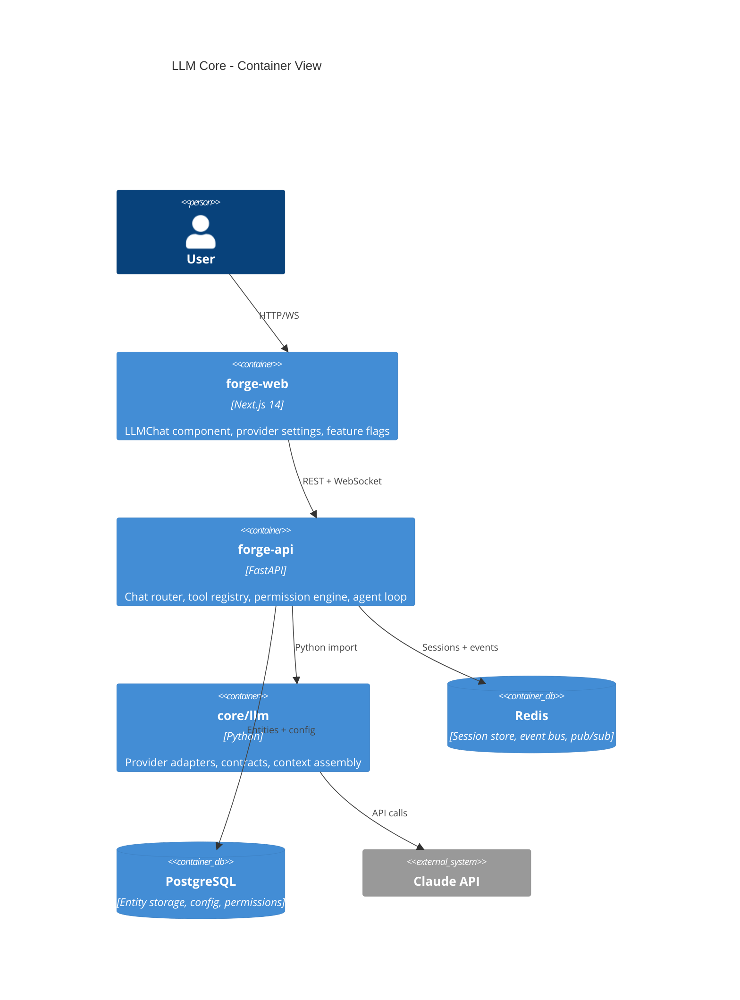
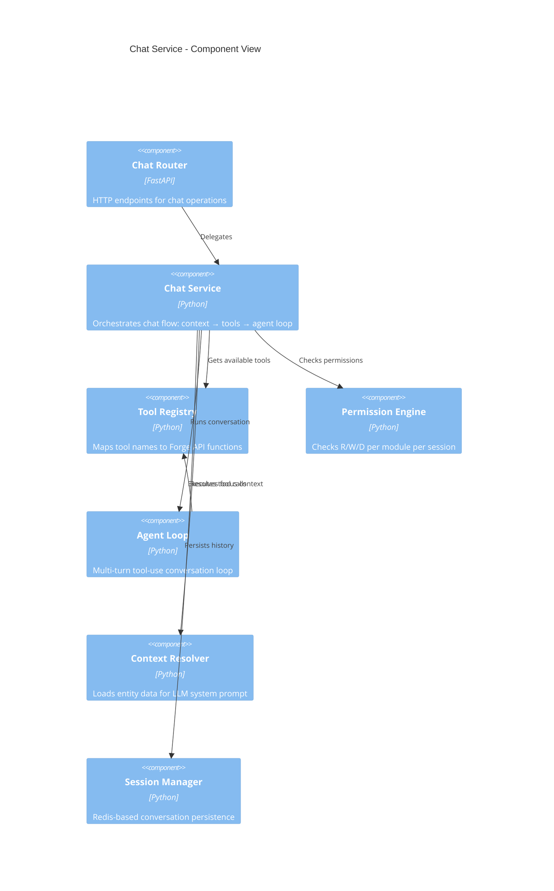

# Deep-Architect Analysis: LLM Core Integration (O-010 + O-011)
Date: 2026-03-12T10:30:00Z
Skill: deep-architect v1.0
Objective: O-010, O-011

---

## 1. Context

### Functional Requirements
- Live LLM provider connection (Claude first, provider-agnostic)
- Tool-use based chat (LLM calls Forge API through tools)
- Reusable chat component embeddable in any UI module
- Permission system (per-project + global R/W/D control)
- Context system (LLM receives focus context from current view)
- Feature flags per module
- Session management with token/cost tracking
- Multi-file skills (SKILL.md + scripts/ + references/ + assets/)
- Drag & drop file upload for LLM context
- Streaming responses in real-time

### Quality Attributes
- **Latency**: First token in <2s for Claude Sonnet
- **Reliability**: Graceful degradation if LLM unavailable
- **Security**: API keys never exposed, permissions enforced
- **Extensibility**: Adding LLM to a new module = define context + tools (no backend changes)
- **Cost control**: Token tracking, session limits, model selection

### Constraints
- G-002 (MUST): Every LLM interaction uses LLMContract
- Existing WebSocket infrastructure (Redis Pub/Sub)
- Existing Zustand store pattern
- Python backend (FastAPI), TypeScript frontend (Next.js 14)
- Current SkillEditor.tsx (670 lines) must be refactored, not rewritten

### Integration Points
- forge-api (FastAPI) — new chat router + provider management
- forge-web (Next.js) — LLMChat component, provider settings UI
- core/llm/ — existing provider adapters + contracts
- Redis — session storage + event streaming
- WebSocket — token streaming + tool call events

## 2. Design

### 2.1 Component Decomposition

```
┌─────────────────────────────────────────────────────────────────────┐
│                        LLM CORE SYSTEM                              │
│                                                                     │
│  ┌──────────────────────────────────────────────────────────────┐   │
│  │                    FRONTEND (forge-web)                       │   │
│  │                                                              │   │
│  │  ┌──────────────┐  ┌─────────────┐  ┌───────────────────┐  │   │
│  │  │  <LLMChat>   │  │ ProviderUI  │  │ FeatureFlagUI     │  │   │
│  │  │              │  │             │  │                   │  │   │
│  │  │ • MessageList│  │ • API keys  │  │ • Per-module      │  │   │
│  │  │ • InputBar   │  │ • Models    │  │   toggle          │  │   │
│  │  │ • ToolView   │  │ • Test      │  │ • Permissions     │  │   │
│  │  │ • StreamMgr  │  │ • Cost dash │  │                   │  │   │
│  │  └──────┬───────┘  └──────┬──────┘  └───────┬───────────┘  │   │
│  │         │                 │                  │              │   │
│  │  ┌──────┴─────────────────┴──────────────────┴──────────┐  │   │
│  │  │              chatStore (Zustand)                       │  │   │
│  │  │                                                       │  │   │
│  │  │  • conversations[]   • activeId    • streaming       │  │   │
│  │  │  • sendMessage()     • subscribe() • permissions     │  │   │
│  │  └──────────────────────────┬────────────────────────────┘  │   │
│  │                             │                               │   │
│  │  ┌──────────────────────────┴────────────────────────────┐  │   │
│  │  │              WebSocket (ForgeWebSocket)                │  │   │
│  │  │                                                       │  │   │
│  │  │  Events: chat.token, chat.tool_call, chat.complete,  │  │   │
│  │  │          chat.error, chat.session_started             │  │   │
│  │  └───────────────────────────────────────────────────────┘  │   │
│  └──────────────────────────────────────────────────────────────┘   │
│                                                                     │
│  ┌──────────────────────────────────────────────────────────────┐   │
│  │                    BACKEND (forge-api)                        │   │
│  │                                                              │   │
│  │  ┌──────────────────────────────────────────────────────┐   │   │
│  │  │              Chat Router (/api/v1/llm/*)              │   │   │
│  │  │                                                       │   │   │
│  │  │  POST /chat          — send message, get response     │   │   │
│  │  │  GET  /sessions      — list chat sessions             │   │   │
│  │  │  GET  /sessions/{id} — session detail + history       │   │   │
│  │  │  GET  /providers     — list configured providers      │   │   │
│  │  │  POST /providers/test— test connection                │   │   │
│  │  │  GET  /config        — feature flags + permissions    │   │   │
│  │  │  PUT  /config        — update feature flags           │   │   │
│  │  └──────────────┬───────────────────────────────────────┘   │   │
│  │                 │                                            │   │
│  │  ┌──────────────┴───────────────────────────────────────┐   │   │
│  │  │              Chat Service                             │   │   │
│  │  │                                                       │   │   │
│  │  │  • resolve_context(type, id) → ContextPayload        │   │   │
│  │  │  • resolve_tools(type, permissions) → ToolDefinition[]│   │   │
│  │  │  • check_permissions(session, tool_call) → bool       │   │   │
│  │  │  • execute_tool(tool_name, args) → ToolResult         │   │   │
│  │  │  • run_agent_loop(messages, tools, context) → stream  │   │   │
│  │  └──────────────┬───────────────────────────────────────┘   │   │
│  │                 │                                            │   │
│  │  ┌──────────────┴───────────────────────────────────────┐   │   │
│  │  │              Tool Registry                            │   │   │
│  │  │                                                       │   │   │
│  │  │  GLOBAL TOOLS:                                        │   │   │
│  │  │  • searchEntities   • getEntity    • listEntities    │   │   │
│  │  │  • getProject       • listProjects                   │   │   │
│  │  │                                                       │   │   │
│  │  │  SKILL TOOLS (when context.type == 'skill'):          │   │   │
│  │  │  • updateSkillContent  • addSkillFile                │   │   │
│  │  │  • removeSkillFile     • updateSkillMetadata         │   │   │
│  │  │  • runSkillLint        • getOtherSkill               │   │   │
│  │  │  • previewSkill        • instantiateAC               │   │   │
│  │  │                                                       │   │   │
│  │  │  TASK TOOLS (future, when context.type == 'task'):    │   │   │
│  │  │  • getTaskContext      • updateTask                  │   │   │
│  │  │  • addDecision         • recordChange                │   │   │
│  │  │                                                       │   │   │
│  │  │  OBJECTIVE TOOLS (future):                            │   │   │
│  │  │  • getObjectiveStatus  • updateKR                    │   │   │
│  │  │  • suggestIdeas                                      │   │   │
│  │  └──────────────┬───────────────────────────────────────┘   │   │
│  │                 │                                            │   │
│  │  ┌──────────────┴───────────────────────────────────────┐   │   │
│  │  │         Permission Engine                             │   │   │
│  │  │                                                       │   │   │
│  │  │  Global Config:                                       │   │   │
│  │  │  {                                                    │   │   │
│  │  │    "skills": {"read": true, "write": true},          │   │   │
│  │  │    "projects": {"read": true, "write": false},       │   │   │
│  │  │    "objectives": {"read": true, "write": false}      │   │   │
│  │  │  }                                                    │   │   │
│  │  │                                                       │   │   │
│  │  │  Project Overrides:                                   │   │   │
│  │  │  {                                                    │   │   │
│  │  │    "tasks": {"read": true, "write": true},           │   │   │
│  │  │    "decisions": {"read": true, "write": true}        │   │   │
│  │  │  }                                                    │   │   │
│  │  └──────────────────────────────────────────────────────┘   │   │
│  │                                                              │   │
│  │  ┌──────────────────────────────────────────────────────┐   │   │
│  │  │         LLM Provider Layer                            │   │   │
│  │  │                                                       │   │   │
│  │  │  ProviderRegistry → get("anthropic") → AnthropicProv │   │   │
│  │  │                   → get("openai")    → OpenAIProv    │   │   │
│  │  │                   → get("ollama")    → OllamaProv    │   │   │
│  │  │                                                       │   │   │
│  │  │  ContractRegistry → get("skill-chat-v1")             │   │   │
│  │  │                   → get("entity-chat-v1")            │   │   │
│  │  └──────────────────────────────────────────────────────┘   │   │
│  │                                                              │   │
│  │  ┌──────────────────────────────────────────────────────┐   │   │
│  │  │         Session Store (Redis)                         │   │   │
│  │  │                                                       │   │   │
│  │  │  Key: chat:session:{session_id}                      │   │   │
│  │  │  TTL: 24h                                            │   │   │
│  │  │  Data: {messages[], context, tokens, cost, model}    │   │   │
│  │  │                                                       │   │   │
│  │  │  Events → EventBus → WebSocket → Debug Console       │   │   │
│  │  └──────────────────────────────────────────────────────┘   │   │
│  └──────────────────────────────────────────────────────────────┘   │
└─────────────────────────────────────────────────────────────────────┘
```

### 2.2 C4 Diagrams

#### C4 Context Diagram


#### C4 Container Diagram


#### C4 Component Diagram (Chat Service)


### 2.3 API Boundaries

```
CHAT API:

POST /api/v1/llm/chat
  Body: {
    context: {type: "skill", id: "S-003", slug?: "my-project"},
    message: "Change the description to...",
    session_id?: "existing-session-id",
    model?: "claude-sonnet-4-20250514"
  }
  Response (streaming via WS):
    → {type: "session_started", session_id: "..."}
    → {type: "token", content: "I'll update...", index: 0}
    → {type: "tool_call", name: "updateSkillContent", args: {...}}
    → {type: "tool_result", name: "updateSkillContent", result: {...}}
    → {type: "token", content: "Done! I've updated...", index: 15}
    → {type: "complete", usage: {input: 1200, output: 450}, cost: 0.004}

GET /api/v1/llm/sessions
  Response: {sessions: [{id, context, created_at, message_count, tokens_used}]}

GET /api/v1/llm/sessions/{id}
  Response: {session_id, messages: [...], context, total_tokens, cost}

GET /api/v1/llm/providers
  Response: {providers: [{name, type, models, default_model, status: "connected"|"error"}]}

POST /api/v1/llm/providers/test
  Body: {provider: "anthropic"}
  Response: {status: "ok", latency_ms: 340, model: "claude-sonnet-4-20250514"}

GET /api/v1/llm/config
  Response: {
    feature_flags: {skills: true, objectives: false, ...},
    permissions: {global: {...}, projects: {slug: {...}}}
  }

PUT /api/v1/llm/config
  Body: {feature_flags?: {...}, permissions?: {...}}
```

### 2.4 Data Flow: Chat Message Lifecycle

```
User types message in <LLMChat>
    │
    ▼
chatStore.sendMessage(sessionId, text)
    │
    ├──→ Add user message to store (optimistic)
    │
    ├──→ POST /api/v1/llm/chat {context, message, session_id}
    │
    ▼
Chat Router receives request
    │
    ├──→ Session Manager: load or create session from Redis
    │
    ├──→ Context Resolver: load entity data (skill S-003 → full skill object)
    │
    ├──→ Permission Engine: load permissions for this context
    │
    ├──→ Tool Registry: get tools for context type + filter by permissions
    │
    ├──→ Build messages array: system prompt (context + tools) + history + user message
    │
    ▼
Agent Loop starts
    │
    ├──→ provider.stream(messages, config)
    │        │
    │        ├──→ Claude API: streaming response
    │        │
    │        ├──→ For each token: emit WS event {type: "token", content: "..."}
    │        │        │
    │        │        └──→ chatStore.updateMessage() (append token)
    │        │
    │        ├──→ If stop_reason == "tool_use":
    │        │        │
    │        │        ├──→ emit WS event {type: "tool_call", name, args}
    │        │        │
    │        │        ├──→ Permission Engine: check write permission for tool
    │        │        │
    │        │        ├──→ Tool Registry: execute tool (e.g., updateSkillContent)
    │        │        │        │
    │        │        │        └──→ Forge API: PATCH /api/v1/skills/S-003
    │        │        │             (triggers WS: skill.updated)
    │        │        │
    │        │        ├──→ emit WS event {type: "tool_result", result}
    │        │        │
    │        │        └──→ Continue loop: add tool result to messages → stream again
    │        │
    │        └──→ If stop_reason == "end_turn":
    │                 │
    │                 ├──→ emit WS event {type: "complete", usage, cost}
    │                 │
    │                 └──→ Session Manager: save messages + usage to Redis
    │
    └──→ EventBus: emit "llm.session_completed" (for Debug Console)
```

### 2.5 Technology Choices

| Component | Technology | Rationale |
|-----------|-----------|-----------|
| LLM Transport | Direct API (anthropic SDK) | Already implemented, LiteLLM adds dependency without value for 2-3 providers |
| Chat Streaming | WebSocket | Existing infrastructure, bidirectional |
| Session Storage | Redis (JSON, TTL 24h) | Fast, automatic cleanup, already available |
| Permission Storage | PostgreSQL (llm_config table) | Persistent, queryable |
| Frontend Chat | React component + Zustand | Existing patterns |
| Markdown Rendering | react-markdown + remark-gfm | Standard, well-maintained |
| Code Highlighting | highlight.js | Lightweight, many languages |

## 3. Adversarial Analysis

### STRIDE Threat Model (key findings)

| Threat | Component | Risk | Mitigation |
|--------|-----------|------|------------|
| **Spoofing** | Chat API | Unauthorized LLM calls | JWT/API key auth (already exists) |
| **Tampering** | Tool execution | LLM manipulates tool args to access other entities | Strict JSON Schema validation + scoping (tool only accesses context entity) |
| **Information Disclosure** | API keys | Keys leaked in API responses or logs | Keys stored in env vars only, never in DB or responses, masked in UI |
| **Elevation of Privilege** | Permission bypass | LLM tricks user into granting write access | Permissions set by admin, not changeable via chat. Tool calls logged. |

### Anti-Pattern Check

| Anti-Pattern | Risk | Mitigation |
|-------------|------|------------|
| God Service | Chat Service does too much | Separated into: ContextResolver, ToolRegistry, PermissionEngine, AgentLoop, SessionManager |
| Distributed Monolith | LLM core tightly coupled to forge-api | core/llm/ is a standalone Python package, forge-api is just the HTTP adapter |
| Chatty Interface | Too many WS events per token | Batch tokens (send every 50ms, not every token) |

### Pre-Mortem

**Scenario: "LLM integration launched but nobody uses it"**

Root cause chain:
1. Response latency too high (>5s for first token)
2. Tool calls fail silently → user loses trust
3. Permission system too restrictive by default → LLM can't do anything useful
4. No way to undo LLM changes → users afraid to let it modify things

Warning signs: Low session count, high abandon rate, support tickets about "AI not working"

**Mitigation:** Fast model by default (Sonnet), visible tool call status, sensible default permissions (read all + write current entity), undo via entity version history.

## 4. Architecture Decision Records (ADRs)

### ADR-1: Global Chat Endpoint over Per-Module Endpoints
**Chose**: Single `POST /api/v1/llm/chat` with context routing
**Over**: Per-module endpoints (`/skills/{id}/chat`, `/tasks/{id}/chat`, etc.)
**Because**: Maximum reusability, single permission check path, one endpoint to maintain. Context-specific behavior achieved through ToolRegistry resolution.
**Tradeoff**: Slightly more complex routing logic in Chat Service, but far less code duplication.

### ADR-2: WebSocket for Chat Streaming over SSE
**Chose**: Extend existing WebSocket with chat event types
**Over**: Server-Sent Events (SSE) or fetch streaming
**Because**: WebSocket infrastructure already exists (ForgeWebSocket, ws.py), bidirectional (cancel, interrupt), natural for tool call interleaving.
**Tradeoff**: Slightly higher server resource usage per connection, but already amortized by existing WS usage.

### ADR-3: Agentic Loop with Tool-Use over Text-Only Generation
**Chose**: Multi-turn agent loop where LLM calls tools autonomously
**Over**: Text-only generation with manual "Apply" buttons
**Because**: User explicitly wants LLM to "do things" — modify skills, run lint, change metadata. Text-only would require manual application of every suggestion.
**Tradeoff**: Higher token cost, more complex error handling, needs strong permission system.

### ADR-4: Environment Variables for API Keys over DB Storage
**Chose**: API keys in environment variables (ANTHROPIC_API_KEY, OPENAI_API_KEY)
**Over**: Encrypted storage in PostgreSQL with UI management
**Because**: Security (keys never touch the database or API responses), simplicity (no encryption key management), follows 12-factor app principles.
**Tradeoff**: Can't change keys without restarting the server. Acceptable for v1.

### ADR-5: JSONB Array for Multi-File Skills over Separate Table
**Chose**: `files JSONB` column in skills table with `[{path, content, type}]`
**Over**: Separate `skill_files` table with FK to skills
**Because**: Skills are small (<500 lines SKILL.md + short scripts), JSONB avoids JOINs, matches existing patterns (evals_json), single atomic update.
**Tradeoff**: Size limit (~1MB practical), no per-file versioning. Acceptable for v1 — migrate to separate table if skills grow.

### ADR-6: Redis for Chat Sessions over PostgreSQL
**Chose**: Redis with TTL 24h for session storage
**Over**: PostgreSQL table for persistent sessions
**Because**: Chat sessions are ephemeral (24h TTL is sufficient), Redis is fast for frequent reads (token streaming), already available in Docker Compose.
**Tradeoff**: Sessions lost on Redis restart. Acceptable — sessions are not critical data, can be recreated.

## 5. Component Responsibility Table

| Component | Responsibility | Dependencies |
|-----------|---------------|-------------|
| **Chat Router** | HTTP endpoints, request validation, WS event emission | Chat Service |
| **Chat Service** | Orchestrates flow: context → tools → permissions → loop | Context Resolver, Tool Registry, Permission Engine, Agent Loop, Session Manager |
| **Context Resolver** | Loads entity data for LLM system prompt | Storage Adapter |
| **Tool Registry** | Maps tool names to functions, provides JSON Schema definitions | Forge API internals |
| **Permission Engine** | Checks R/W/D per module, loads from config | Redis (cached), PostgreSQL (persistent) |
| **Agent Loop** | Multi-turn LLM conversation with tool execution | LLM Provider, Tool Registry |
| **Session Manager** | Create/load/save sessions, track tokens/costs | Redis |
| **LLMChat Component** | React UI for chat: messages, input, tool display | chatStore, WebSocket |
| **chatStore** | Zustand store for chat state, WS event handling | WebSocket client |
| **ProviderSettings UI** | Configure providers, test connection | LLM config API |
