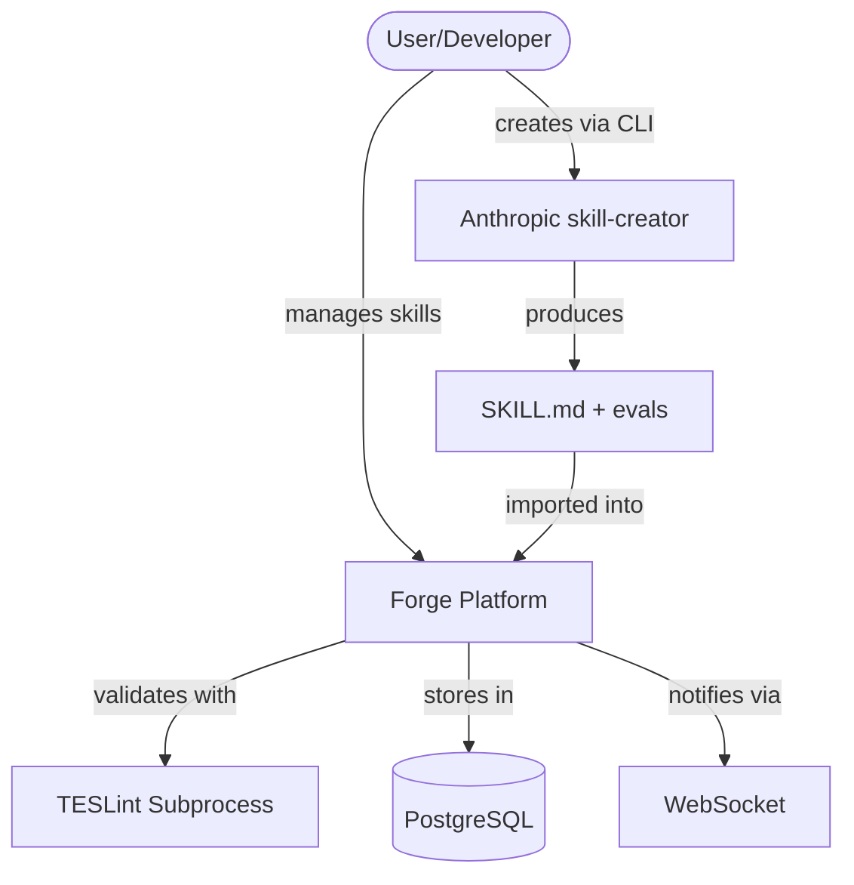
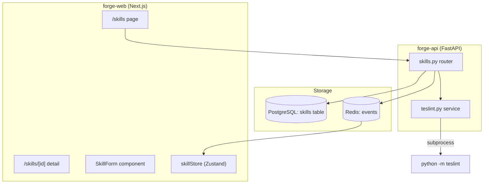
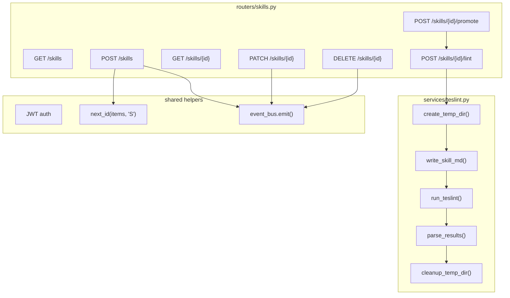

# Deep Architect Analysis: O-009 Skills Management
Date: 2026-03-11T22:30:00Z
Skill: deep-architect v1.0.0
Decision: D-017 (linked after recording)

---

## Overview

Global Skills management module for Forge Platform — first platform-level entity (not per-project). Provides CRUD, lifecycle management (DRAFT→ACTIVE→DEPRECATED→ARCHIVED), TESLint validation, categorization, and integration with task execution.

## C4 Diagrams

### Context

### Container

### Component (Backend Detail)

## Components

| Component | Responsibility | Technology | Interfaces |
|-----------|---------------|------------|------------|
| skills.py router | CRUD + lint + promote endpoints | FastAPI | REST API at /api/v1/skills |
| teslint.py service | TESLint subprocess management | Python subprocess + tempfile | Internal: run_lint(skill_md_content, name) → findings |
| skills table | Persistent storage | PostgreSQL | SQL: CRUD, GIN indexes on tags/scopes |
| skillStore.ts | Client-side state | Zustand (factory) | useSkillStore hook |
| SkillsPage | List/filter/search view | Next.js + React | Route: /skills |
| SkillDetailPage | Detail view with SKILL.md preview | Next.js + React | Route: /skills/[id] |
| SkillForm | Create/edit modal | react-hook-form + zod | Component: <SkillForm onSuccess={...} /> |
| SkillCard | Card display | React | Component: <SkillCard skill={...} /> |
| TESLintReport | Lint findings display | React | Component: <TESLintReport findings={...} /> |
| SkillMdEditor | SKILL.md text editor with lint | React | Component: <SkillMdEditor value={...} onLint={...} /> |

## Architecture Decision Records

### ADR-1: Full DB Storage Over Hybrid Filesystem
- **Status:** Accepted
- **Context:** Skills have SKILL.md content + evals + optional bundled resources. Need to decide storage approach.
- **Decision:** Store SKILL.md as TEXT, evals as JSONB, resource metadata as JSONB in PostgreSQL.
- **Alternatives:** Hybrid DB+filesystem (complex deployment), pure filesystem (no query capability)
- **Consequences:** Gain: simple backup, single storage, queryable, consistent with other entities. Lose: TESLint needs temp dir extraction (~100-500ms on lint/promote only).

### ADR-2: Global Routing Without Project Slug
- **Status:** Accepted
- **Context:** Skills are platform-level entities, not project-scoped. Current API is all under /projects/{slug}/.
- **Decision:** Mount skills router at /api/v1/skills (no slug prefix). Separate router with own auth dependency.
- **Alternatives:** Virtual "global" project (hacky), per-project skill copies (data duplication)
- **Consequences:** Gain: correct domain model, clean separation. Lose: need to extract shared helpers from _helpers.py.

### ADR-3: TESLint as Subprocess With Temp Dir
- **Status:** Accepted
- **Context:** TESLint is a Python CLI tool that scans directories for .claude/skills/*/SKILL.md.
- **Decision:** Backend creates temp dir with correct structure, runs python -m teslint, parses JSON output, cleans up.
- **Alternatives:** Import as Python library (not supported), port rules to JS (too much work), skip TESLint (loses value)
- **Consequences:** Gain: use TESLint as-is, no forking. Lose: subprocess overhead (~1s), needs PyYAML in Docker image.

### ADR-4: Update-in-Place for v1, Defer Versioning
- **Status:** Accepted
- **Context:** Users may edit ACTIVE skills. Tasks referencing them see updated content immediately.
- **Decision:** PATCH updates in-place. promotion_history tracks lifecycle events. No SKILL.md version history in v1.
- **Alternatives:** Full version history (complex), copy-on-write (over-engineered for v1)
- **Consequences:** Gain: simplicity, matches existing entity pattern. Lose: no diff/rollback for SKILL.md edits.

### ADR-5: Force Override on Promotion With Audit Trail
- **Status:** Accepted
- **Context:** TESLint may report errors user considers acceptable (e.g., intentionally disabled rules).
- **Decision:** POST /skills/{id}/promote accepts force:true. Records promoted_with_warnings + full audit entry.
- **Alternatives:** No override (too strict), configurable threshold (too complex)
- **Consequences:** Gain: flexibility with accountability. Lose: potentially lower quality ACTIVE skills (mitigated by warning badge).

## Adversarial Findings

| # | Challenge | Finding | Severity | Mitigation |
|---|-----------|---------|----------|------------|
| 1 | STRIDE | SKILL.md content injection via XSS if rendered as raw HTML | Medium | Sanitized markdown renderer. Never dangerouslySetInnerHTML. |
| 2 | FMEA | TESLint subprocess hangs → blocks API thread | Medium | 10s timeout on subprocess. asyncio.wait_for() wrapper. |
| 3 | Anti-pattern | Skills table has 15+ columns including JSONB blobs | Low | Acceptable for v1. JSONB is lazily loaded. Split if needed in v2. |
| 4 | Pre-mortem | 6 months: "Nobody uses Skills because they don't know they exist" | Medium | Top-level nav. Dashboard widget. Usage tracking counter. |
| 5 | Dependency | TESLint is external (Deep-Process). Could be abandoned. | Low | MIT licensed. Fork-able. Only 35 rules. |
| 6 | Scale | 1000 skills × 500 lines = 40MB in DB | Low | Trivial for PostgreSQL. |
| 7 | Cost | TESLint subprocess CPU per lint call | Low | User-initiated only. 10s timeout. Negligible. |
| 8 | Ops | Who monitors TESLint compatibility on updates? | Low | Pin version. Update on schedule. |

## Tradeoffs

| Chose | Over | Because | Lost | Gained |
|-------|------|---------|------|--------|
| Full DB storage | Hybrid filesystem | Simpler deployment + backup | Native file access for TESLint | Single storage, queryable |
| Global /api/v1/skills | Virtual global project | Correct domain model | Code reuse from _helpers.py | Clean separation |
| Subprocess TESLint | Import as library | TESLint doesn't support library use | Startup time per invocation | Zero maintenance of rules |
| Update-in-place | Version history | Simplicity for v1 | Edit history / rollback | Less code, faster delivery |
| Force override | Strict gate only | User flexibility | Guaranteed quality | Practical usability |
| Plain textarea editor | CodeMirror/Monaco | Scope control for v1 | Syntax highlighting, autocomplete | Faster delivery, less bloat |
